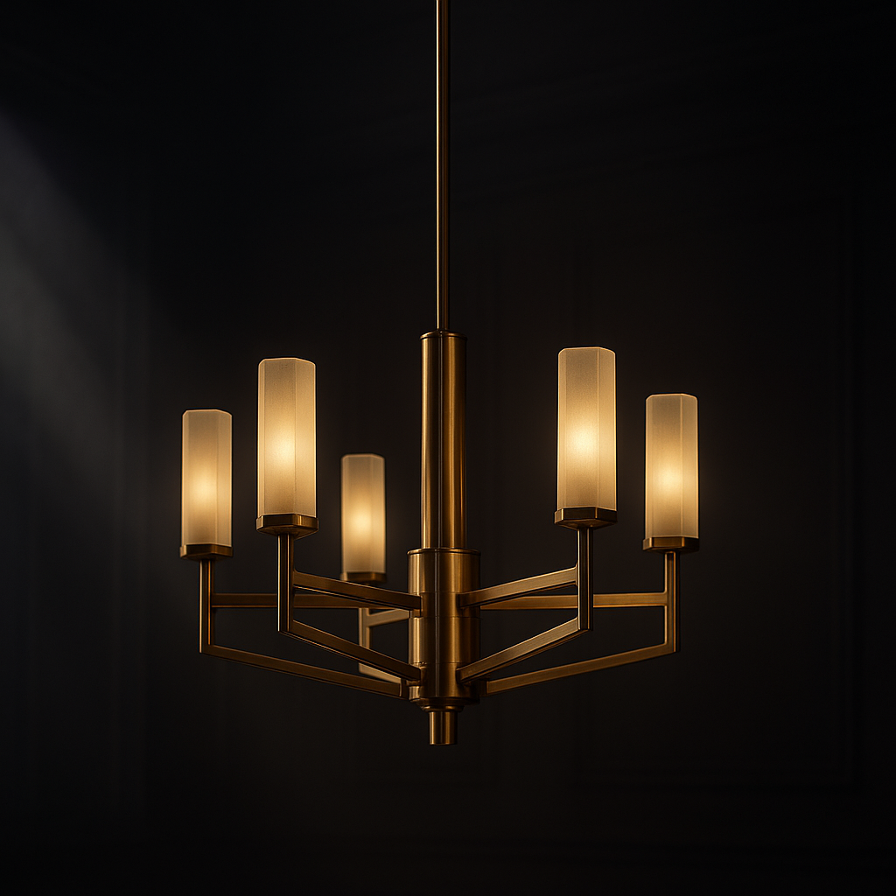
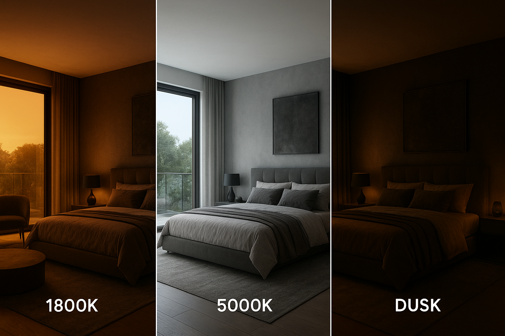
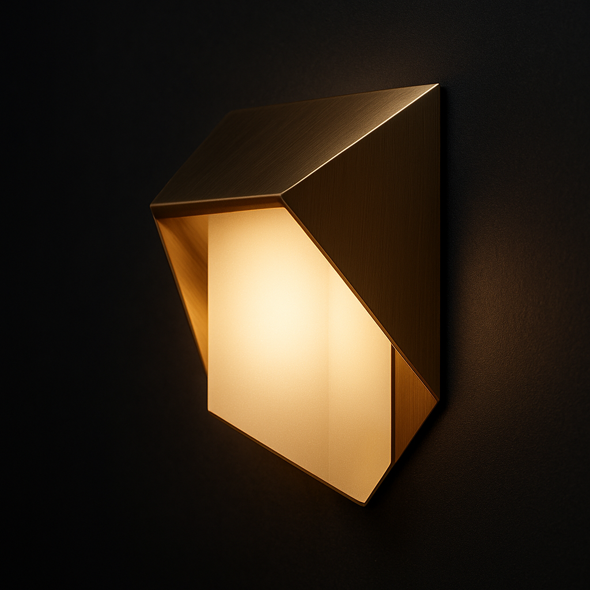

# Luminaluxe — Brand Identity Guidelines

> *Version 1.0 — May 2026*

---

## 1. Brand Essence

**Luminaluxe** is a premium architectural smart lighting brand that transforms interiors into curated sensory experiences. We sit at the intersection of cutting-edge automation and timeless design — where light becomes architecture.

**Brand Pillars:**
- **Artistry** — Every fixture is a sculptural statement
- **Precision** — Engineered perfection in light control
- **Ambiance** — Curating mood, not just illumination
- **Wellness** — Light that follows the sun and nurtures the body

**Brand Archetype:** The Creator — refining the world through craftsmanship, vision, and vitality

**Tone of Voice:** Refined, confident, warm, aspirational, wellness-conscious. Never cold or sterile. We speak like a gallerist and a wellness curator, not a technician.

**Emotional ROI:** Every installation delivers a measurable return in well-being — better sleep, sharper focus, deeper relaxation.

---

## 2. Logo

### Primary Logo


The Luminaluxe wordmark is set in an elegant, custom-drawn sans-serif with subtle geometric precision. The mark — an abstract prism of intersecting light rays — evokes an architectural aperture, a diamond, and the moment light enters a space.

### Logo Variations
- **Primary:** Full wordmark + icon (horizontal lockup) — for all standard applications
- **Icon-Only:** The prism mark alone — for favicon, app icon, social profile picture
- **Stacked:** Wordmark centered above tagline "ILLUMINATED ARCHITECTURE" — for vertical applications

### Minimum Clear Space
Maintain clear space equal to the height of the "L" in LUMINALUXE on all sides of the logo lockup.

### Minimum Size
- Digital: 120px wide (lockup), 44px (icon-only)
- Print: 1.5 inches wide (lockup), 0.5 inches (icon-only)

### Incorrect Usage
- Do not stretch, skew, or rotate the logo
- Do not apply drop shadows or gradients to the logo
- Do not place the logo on low-contrast backgrounds
- Do not rearrange logo elements

---

## 3. Color Palette

Our palette is inspired by architectural materials in a dimly lit gallery: warm metals, deep shadows, and the clean glow of curated light.

### Primary Colors

| Swatch | Name | Hex | RGB | Usage |
|--------|------|-----|-----|-------|
| ■ | **Obsidian** | `#0D0D0D` | `rgb(13,13,13)` | Backgrounds, hero sections, footer |
| ■ | **Charcoal** | `#1C1C1E` | `rgb(28,28,30)` | Section backgrounds, cards, dark UI |
| ■ | **Pewter** | `#2C2C2E` | `rgb(44,44,46)` | Secondary backgrounds, borders |

### Accent Colors

| Swatch | Name | Hex | RGB | Usage |
|--------|------|-----|-----|-------|
| ■ | **Warm Brass** | `#C9A961` | `rgb(201,169,97)` | Primary accent, CTAs, hover states, key highlights |
| ■ | **Burnished Gold** | `#A8853A` | `rgb(168,133,58)` | Secondary accent, hover, decorative lines |
| ■ | **Soft Amber** | `#E8D5A3` | `rgb(232,213,163)` | Subtle highlights, light glow effects |

### Neutral & Light

| Swatch | Name | Hex | RGB | Usage |
|--------|------|-----|-----|-------|
| ■ | **Alabaster** | `#F5F0E8` | `rgb(245,240,232)` | Body text on dark backgrounds, light mode backgrounds |
| ■ | **Warm White** | `#FAF7F2` | `rgb(250,247,242)` | Card backgrounds (light mode), text on dark |
| ■ | **Limestone** | `#E5DDD3` | `rgb(229,221,211)` | Subtle borders, dividers, secondary text (light) |

### Light Effects

| Swatch | Name | Hex | Notes |
|--------|------|-----|-------|
| ■ | **Warm Glow** | `rgba(201,169,97,0.15)` | Subtle ambient glow behind hero elements |
| ■ | **Soft Bloom** | `rgba(201,169,97,0.08)` | Background gradients, light leak effects |

### Accessibility
- On dark backgrounds (#0D0D0D, #1C1C1E): use Alabaster (#F5F0E8) for body text
- On light backgrounds (#FAF7F2): use Charcoal (#1C1C1E) for body text
- Warm Brass (#C9A961) on dark backgrounds passes WCAG AA for large text only

---

## 4. Typography

### Primary Typeface: **Cormorant Garamond**
*Elegant, timeless serif with Renaissance proportions and contemporary sharpness.*

| Weight | Size | Usage |
|--------|------|-------|
| Light 300 | 72–96px | Hero headlines |
| Regular 400 | 48–64px | Section headings (H1) |
| Medium 500 | 32–40px | Subheadings (H2) |
| Semibold 600 | 24–28px | Card titles (H3) |
| Italic 400 | 18–22px | Pull quotes, editorial notes |

### Secondary Typeface: **Inter**
*Clean, highly legible sans-serif with excellent screen rendering.*

| Weight | Size | Usage |
|--------|------|-------|
| Light 300 | 16–18px | Body text, descriptions |
| Regular 400 | 14–16px | UI labels, navigation |
| Medium 500 | 12–14px | Small caps, metadata |
| Bold 700 | 12–14px | Button labels, emphasis |

### Tertiary Typeface: **SF Mono** or **JetBrains Mono**
For technical specifications, wiring diagrams, and control app code snippets.

### Type Scale (Responsive)

```
h1: 72px → 48px (mobile)  | Cormorant Garamond Light
h2: 48px → 36px (mobile)  | Cormorant Garamond Regular
h3: 32px → 24px (mobile)  | Cormorant Garamond Medium
h4: 24px → 20px (mobile)  | Inter Medium
body: 18px → 16px (mobile) | Inter Light
small: 14px                | Inter Regular
caption: 12px              | Inter Regular
```

### Line Height
- Headings: 1.1
- Body text: 1.6
- Small text: 1.4

### Letter Spacing
- Headlines (72px+): -0.02em
- Subheadings (48px): -0.01em
- Body text: 0
- Small caps: +0.05em
- Navigation: +0.08em

---

## 5. 3D Visual Premium Aesthetic

Luminaluxe has adopted a **3D visual premium** aesthetic as our core visual language. This replaces traditional photography for all hero and product imagery, establishing a distinctive, high-fidelity brand world.

### Guiding Principles

| Principle | Description |
|-----------|-------------|
| **Depth** | Every visual should feel dimensional — layered shadows, volumetric light, and physical space between elements |
| **Texture** | Materials render with tactile realism: brushed brass grain, frosted glass diffusion, matte ceramic softness |
| **Drama** | High-contrast lighting with deep blacks and selective illumination — chiaroscuro for the digital age |
| **Precision** | Every reflection, shadow, and glow is calculated — nothing is accidental |

### Visual Style
- **Photorealistic 3D Renders** — All product and hero shots are 3D-rendered, not photographed. This ensures perfect lighting, consistent color, and the ability to iterate without reshoots.
- **Volumetric Light** — Light beams are visible, with dust motes or atmosphere adding physical presence to illumination.
- **Glassmorphism** — For UI overlays and card elements: `backdrop-filter: blur(20px)` with subtle border highlights and 10% white overlays.
- **Dark Mode Native** — All hero imagery lives on deep Obsidian or Charcoal backgrounds. Light elements (fixtures, text, UI) emerge from the darkness.
- **Cinematic Color Grading** — Warm-shifted highlights, neutral midtones, crushed blacks. Think *Blade Runner 2049* meets *Architectural Digest*.

### 3D Render Gallery

| Image | Description | Reference |
|-------|-------------|-----------|
|  | Sculptural brass chandelier floating in volumetric light | Hero/section dividers |
|  | Dawn / Noon / Dusk circadian transition visualization | Circadian Mapping service page |
|  | Macro close-up of brushed brass wall sconce with warm glow | Product detail cards |

### Mood Board References
- Peter Saville's minimalist elegance
- Axel Vervoordt's wabi-sabi interiors
- Apple's product photography precision meets warm Italian modernism
- *Blade Runner 2049* volumetric lighting and atmospheric depth
- Hasselblad / Phase One cinematic color science

---

## 6. Imagery & Photography (Supplementary)

### Style
- **Architectural Editorials** — Interior photography that feels like a *Wallpaper* or *Architectural Digest* spread
- **Dramatic Lighting** — High contrast, deep shadows, warm highlights
- **Material Focus** — Close-ups that reveal texture: brushed brass, matte ceramic, fluted glass, natural stone
- **Atmospheric** — Twilight and dusk scenes with warm interior glow spilling outward
- **3D Renders Preferred** — For all primary brand visuals (hero banners, product pages, social media)

### Image Treatment
- Always warm-toned (never clinical cool white)
- Subtle grain or texture overlay on hero images
- Vignette edges to draw focus to the center
- Black & white conversion reserved for product detail shots only

---

## 7. Graphic Elements

### Light Leaks
Subtle warm light leak gradients used as full-width section dividers. Color: rgba(201,169,97,0.06) to transparent.

### Thin Rule
A 1px horizontal line in Burnished Gold (#A8853A) used to separate sections — always at 30% opacity.

### Geometric Overlays
Inspired by architectural blueprints: subtle grid lines at 5% opacity can appear in hero sections.

### Aperture Frame
A square or circular "aperture" motif (like a camera iris opening) used as a decorative element behind key copy.

### Glassmorphism Cards
For UI elements: `background: rgba(28, 28, 30, 0.6); backdrop-filter: blur(20px); border: 1px solid rgba(201, 169, 97, 0.1);`

### 3D Depth Layers
Hero sections should use z-layered parallax: light beam (furthest), fixture render (middle), UI text/elements (front). Creates a immersive 3D environment.

---

## 8. Circadian Rhythm & Human-Centric Lighting (HCL)

### Brand Positioning
Luminaluxe leads the luxury wellness lighting market by integrating **Circadian Mapping** — a proprietary service that synchronizes indoor illumination with the human body's natural 24-hour cycle.

### The Science
Human-centric lighting is no longer optional for luxury interiors. Research shows that static indoor lighting disrupts melatonin production, impairs sleep quality, and reduces cognitive performance. Luminaluxe solves this with dynamic spectral tuning.

### The Four Phases

| Phase | Time | Color Temp | Feeling | Wellness Benefit |
|-------|------|----------|---------|-----------------|
| **Dawn** | 05:00–08:00 | 1800K–2700K | Deep amber → soft awakening | Gentle cortisol rise |
| **Noon** | 08:00–17:00 | 4000K–5000K | Bright, high-CRI focus | Peak alertness & productivity |
| **Dusk** | 17:00–21:00 | 2700K–1800K | Warm golden → deep amber | Melatonin onset signal |
| **Night** | 21:00–05:00 | 1800K (dim) | Ultra-low intensity amber | Undisturbed deep sleep |

### Visualizing Circadian Flow
The circadian triptych image (`img/luminaluxe-3d-circadian.jpg`) is a signature brand asset showing the same interior at Dawn, Noon, and Dusk — demonstrating how Luminaluxe transforms a space through the day.

### Messaging for HCL
- "Light that follows the sun"
- "Your circadian rhythm, perfectly curated"
- "Well-being begins with illumination"
- "From dawn through dusk — intelligent light for body and mind"

---

## 9. Iconography

Minimalist, thin-line icons with rounded terminals. 2px stroke weight.
- Use Warm Brass (#C9A961) as the accent color for icons
- Never use filled icons on dark backgrounds
- Icons should feel like architectural details, not digital buttons

---

## 8. Application Examples

### Stationery
- Business cards: Obsidian stock, foil-stamped Warm Brass logo, thin gold edge
- Letterhead: Alabaster paper, embossed logo, Charcoal text

### Digital
- Website: Dark mode default with Alabaster text, horizontal scroll galleries
- App: Obsidian sidebar navigation, Warm Brass accent buttons, smooth transitions
- Email: Alabaster background, Charcoal text, carefully limited use of accent color

### Environmental
- Showroom: Dark walls, track lighting on product displays, Warm Brass signage on Obsidian
- Packaging: Matte black box with blind emboss, Warm Brass foil stamp, soft-touch coating

---

## 10. Voice & Messaging

### Taglines
- **Primary:** *Illuminated Architecture*
- **Secondary:** *Light that follows the sun*
- **Tertiary:** *Where Design Meets Illumination*
- **Wellness:** *Your circadian rhythm, perfectly curated*

### Writing Style
- Capitalize "Luminaluxe" with its proper capital L
- Use sentence case for headlines (not ALL CAPS or Title Case)
- Avoid technical jargon in consumer-facing copy
- Lead with emotion and design, follow with technology

### Examples of Brand Language
| ❌ Avoid | ✅ Use |
|----------|-------|
| "Bright 1200 lumen LED fixture" | "Sculptural radiance for the discerning space" |
| "Smart lighting controller app" | "Your personal light curator" |
| "Buy now - 20% off" | "Arrange a private consultation" |
| "IoT-enabled smart bulbs" | "Intelligent illumination, seamlessly yours" |

---

## 11. Brand Assets

| Asset | File | Path |
|-------|------|------|
| Primary Logo | PNG | `img/luminaluxe-logo.png` |
| Hero Image | JPEG | `img/luminaluxe-hero.jpg` |
| Product Detail | JPEG | `img/luminaluxe-product.jpg` |
| 3D Candelabra Render | JPEG | `img/luminaluxe-3d-candelabra.jpg` |
| 3D Circadian Triptych | JPEG | `img/luminaluxe-3d-circadian.jpg` |
| 3D Fixture Detail | JPEG | `img/luminaluxe-3d-fixture.jpg` |

---

*These guidelines are a living document. All brand applications must be reviewed against this standard before publication.*

© 2026 Luminaluxe. All rights reserved./home/engine/.bashrc: line 1: syntax error near unexpected token `('
/home/engine/.bashrc: line 1: `. /etc/profile.d/workload-containment.shn# ~/.bashrc: executed by bash(1) for non-login shells.'
/home/engine/.bashrc: line 1: syntax error near unexpected token `('
/home/engine/.bashrc: line 1: `. /etc/profile.d/workload-containment.shn# ~/.bashrc: executed by bash(1) for non-login shells.'
/home/engine/.bashrc: line 1: syntax error near unexpected token `('
/home/engine/.bashrc: line 1: `. /etc/profile.d/workload-containment.shn# ~/.bashrc: executed by bash(1) for non-login shells.'
/home/engine/.bashrc: line 1: syntax error near unexpected token `('
/home/engine/.bashrc: line 1: `. /etc/profile.d/workload-containment.shn# ~/.bashrc: executed by bash(1) for non-login shells.'
/home/engine/.bashrc: line 1: syntax error near unexpected token `('
/home/engine/.bashrc: line 1: `. /etc/profile.d/workload-containment.shn# ~/.bashrc: executed by bash(1) for non-login shells.'
/home/engine/.bashrc: line 1: syntax error near unexpected token `('
/home/engine/.bashrc: line 1: `. /etc/profile.d/workload-containment.shn# ~/.bashrc: executed by bash(1) for non-login shells.'
/home/engine/.bashrc: line 1: syntax error near unexpected token `('
/home/engine/.bashrc: line 1: `. /etc/profile.d/workload-containment.shn# ~/.bashrc: executed by bash(1) for non-login shells.'
/home/engine/.bashrc: line 1: syntax error near unexpected token `('
/home/engine/.bashrc: line 1: `. /etc/profile.d/workload-containment.shn# ~/.bashrc: executed by bash(1) for non-login shells.'
/home/engine/.bashrc: line 1: syntax error near unexpected token `('
/home/engine/.bashrc: line 1: `. /etc/profile.d/workload-containment.shn# ~/.bashrc: executed by bash(1) for non-login shells.'
/home/engine/.bashrc: line 1: syntax error near unexpected token `('
/home/engine/.bashrc: line 1: `. /etc/profile.d/workload-containment.shn# ~/.bashrc: executed by bash(1) for non-login shells.'
/home/engine/.bashrc: line 1: syntax error near unexpected token `('
/home/engine/.bashrc: line 1: `. /etc/profile.d/workload-containment.shn# ~/.bashrc: executed by bash(1) for non-login shells.'
/home/engine/.bashrc: line 1: syntax error near unexpected token `('
/home/engine/.bashrc: line 1: `. /etc/profile.d/workload-containment.shn# ~/.bashrc: executed by bash(1) for non-login shells.'
/home/engine/.bashrc: line 1: syntax error near unexpected token `('
/home/engine/.bashrc: line 1: `. /etc/profile.d/workload-containment.shn# ~/.bashrc: executed by bash(1) for non-login shells.'
/home/engine/.bashrc: line 1: syntax error near unexpected token `('
/home/engine/.bashrc: line 1: `. /etc/profile.d/workload-containment.shn# ~/.bashrc: executed by bash(1) for non-login shells.'
/home/engine/.bashrc: line 1: syntax error near unexpected token `('
/home/engine/.bashrc: line 1: `. /etc/profile.d/workload-containment.shn# ~/.bashrc: executed by bash(1) for non-login shells.'
